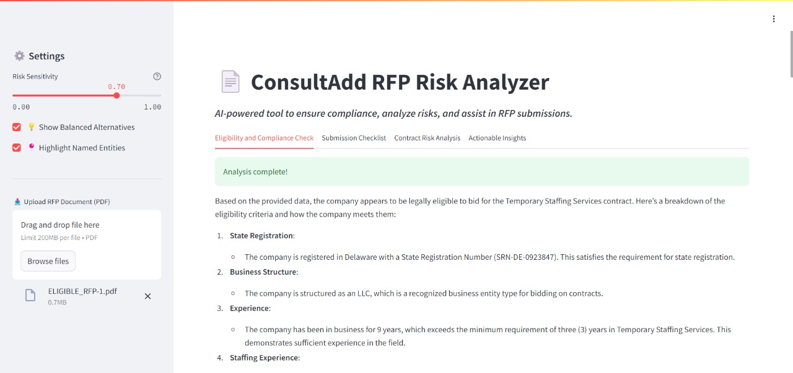
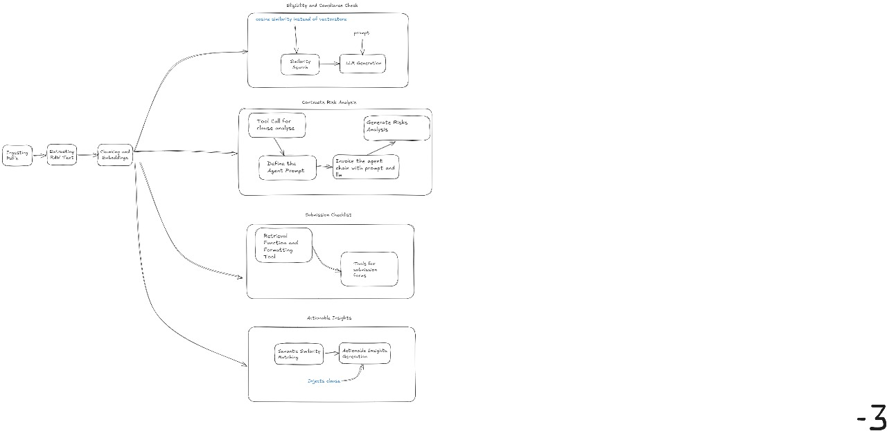

# HomersHackers
All our code, ideas, and projects for the Odyssey of Code hackathon—built and stored here.

## To run the application
1. ```cd ooc/risk```
2. ```streamlit run new_streamlit_ui.py```


## Solution

### UI


### Solution
